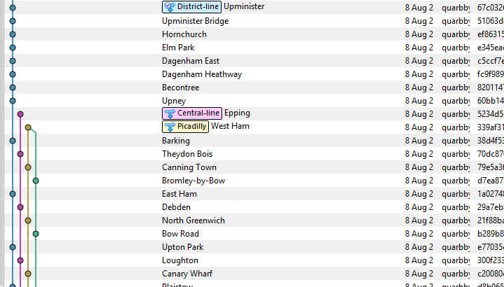

# London Tube Map in Git Network
Because London is a place that's special to my heart

Inspiried by [SMRT-git by Tay Yang Shun](https://github.com/yangshun/smrt-git) which is inspired by [MetroGit](https://github.com/vbarbaresi/MetroGit)

You can visualise it with the [Github Network View](https://github.com/quarbby/london-git/network)



### Generating the Tube Map
```
$./london.sh
```

### Notes:
* Overground and DLR not included
* Picadilly and Jubilee lines are swapped
* Hammersmith-station is Hammersmith and City Line 

* The original Tube Map is


### Apologies & Contributing
* There are some mistakes because I still don't understand the London Tube map and I hacked this out in a few hours. 
* Feel Free to help me out (i.e. fork the repo etc)
